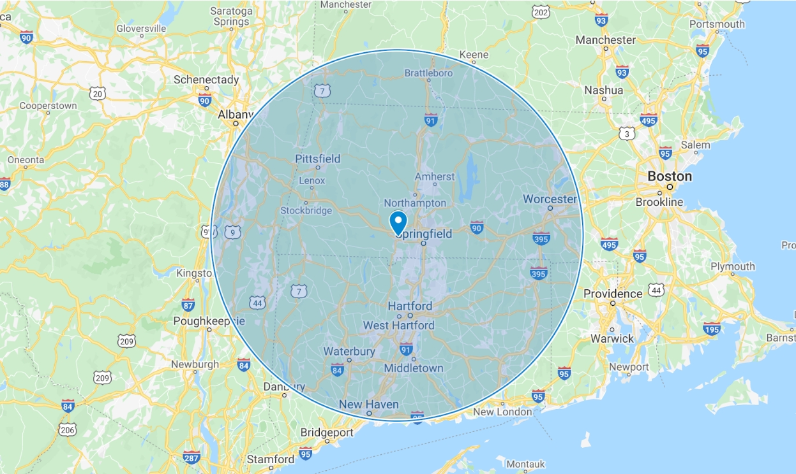
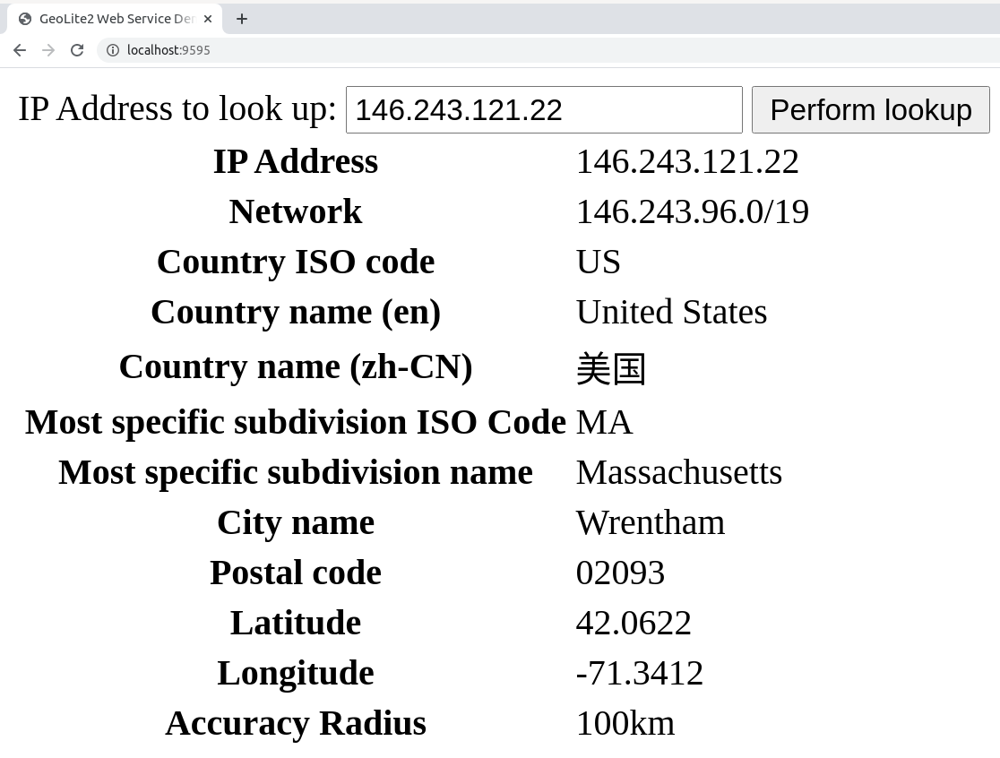

## Integrating MaxMind's Free and Paid IP Geolocation Web Services (in PHP)

In December MaxMind released the new
[GeoLite2 web services](https://dev.maxmind.com/geoip/geoip2/geolite2/), an IP
geolocation API available free of charge.

IP geolocation services provide information about the geographic location of an
IP address. MaxMind offers two free such web services, GeoLite2 City and
GeoLite2 Country, which are comparable to, but less accurate than, MaxMind's
paid GeoIP2 Precision City and GeoIP2 Precision Country web services. GeoLite2
is fully compatible with GeoIP2, using the same API and integration method,
making it easy to switch between the free and paid services as your needs
change. You can compare accuracy of the GeoLite2 and GeoIP2 web services by
selecting a country on the
[GeoIP2 City Accuracy](https://www.maxmind.com/en/geoip2-city-accuracy-comparison)
page.

In this blog post, we are going to review how to build a simple web page in PHP
that uses GeoLite2 City. We will learn how to easily upgrade to the paid GeoIP2
Precision City web service, for greater accuracy and unlimited queries (GeoLite2
web service users are limited to 1,000 queries per service per day).

### A Warning About Precision

Before we dive in, you should be aware that IP geolocation is inherently
imprecise. When MaxMind provides longitude and latitude, the coordinates
provided are often near the center of the population. Any location provided by a
GeoIP database should not be used to identify a particular address or household.
IP geolocation is used to give you an idea of the region, sometimes down to the
level of city or postal code, but it can't pinpoint the source of an internet
connection. To help you have a sense of how precise any given query return is,
MaxMind provides an accuracy radius field in the response. The actual location
of the IP address is likely within the area defined by a circle with its center
at the coordinates returned and a radius equal to the accuracy radius returned.

 _In the example above,
MaxMind returns the coordinates 42.1293, -72.7522 with an accuracy radius of
100km. The actual geolocation of the IP address is likely within the
100km-radius circle shown above._

Okay, let's get started!

### Requirements

- A clone of the [repository](https://github.com/maxmind/geolite2-ws-blogpost)
  used in this code. This requires `git` to be installed.
- A [PHP version >= 7.2](https://www.php.net/downloads.php) must be installed.
- [Composer](https://getcomposer.org/) must be installed. Composer will help you
  manage the dependencies required to integrate with GeoLite2.
- A free MaxMind GeoLite2 account with a license key is required.
  - If you already have a MaxMind account and have signed up for GeoLite2, you
    can generate a new license key
    [here](https://www.maxmind.com/en/accounts/current/license-key) (login
    required) or use your existing one.
  - If you have a MaxMind account but haven't signed up for GeoLite2, you can do
    so [here](https://www.maxmind.com/en/accounts/current/geolite2/eula) (login
    required).
  - If you don't have a MaxMind GeoLite2 account, you can sign up for one
    [here](https://www.maxmind.com/en/geolite2/signup).

### Using Docker or Vagrant

The [code repository](https://github.com/maxmind/geolite2-ws-blogpost) comes
with a
[Dockerfile](https://github.com/maxmind/geolite2-ws-blogpost/blob/main/Dockerfile)
and a
[Vagrantfile](https://github.com/maxmind/geolite2-ws-blogpost/blob/main/Vagrantfile)
included. If you'd like to begin work in an environment which has all of the
necessary software dependencies pre-installed, see our documentation for getting
started with
[Docker](https://github.com/maxmind/geolite2-ws-blogpost/blob/main/README-Docker.md)
and
[Vagrant](https://github.com/maxmind/geolite2-ws-blogpost/blob/main/README-Vagrant.md).

### GeoLite2 City Web Services

The GeoLite2 City web services return information about a provided IP address,
such as its city, subdivision, postal code, country, continent, and approximate
latitude and longitude. For example, when I look up my IP address (i.e., provide
it in an API call to the web service), the service returns the city that I live
in, my province, my postal code, my country, and the circle containing my
estimated latitude and longitude, as well as a number of other fields describing
my IP address.

The GeoLite2 Country web service returns, among other things, the country and
continent in which an IP address resides. GeoLite2 Country responses are
strictly a subset of GeoLite2 City responses, as is the case with GeoIP2
Precision Country and GeoIP2 Precision City.

It is important to note that the web services do not always return every field
for every IP address. Some information is unavailable and some information is
not applicable (e.g., if I look up the IP address 8.8.8.8, which is a Google
Anycast address, it doesn't make sense to return a precise location, since the
IP address has locations all over the world). In these cases MaxMind will return
the subset of the fields for which there is data.

For a full list of the fields returned by each service, see this [side by side
comparison of GeoLite2 and GeoIP2 data
points](https://26vddl1ry78464rf7e94z1ee-wpengine.netdna-ssl.com/wp-content/uploads/2020/12/GeoLite2-and-GeoIP2-Precision-Web-Services-Comparison.pdf).

### The Demo in Action

Let's take a look at the demo application we're going to write today. Here is a
screenshot of a web browser where I use the demo application to look up the IP
address 146.243.121.22.



It's pretty simple: I provide an IP address in the "IP address to look up"
field, hit the "Perform lookup" button, and then I get the information returned
about the IP address and rendered in the browser.

Now let's look at the code and how to implement it.

### Implementing the Demo

The [repository](https://github.com/maxmind/geolite2-ws-blogpost/) for this post
is available on GitHub. To clone it open a terminal to a directory of your
choosing and run the following command:

```bash
git clone https://github.com/maxmind/geolite2-ws-blogpost.git
```

Now we'll have the code in the directory `geolite2-ws-blogpost` directly under our
current directory. Next we change the directory to that.

```bash
cd geolite2-ws-blogpost
```

Next we install Composer as a
[PHAR](https://www.php.net/manual/en/intro.phar.php). See the instructions
[here](https://getcomposer.org/download/).

Once we've installed Composer, we tell it to install the
[GeoIP2 client API](https://github.com/maxmind/GeoIP2-php):

```bash
php composer.phar require geoip2/geoip2:~2.0
```

Now we start the server. This requires a MaxMind account ID and license key. You
can use an existing, stored, license key or [generate a new one in your account
portal](https://www.maxmind.com/en/accounts/current/license-key). Be careful
with this key -- you don't want it getting out in the wild or else anyone can
use it to use up your MaxMind credit! See
[this link](https://support.maxmind.com/account-faq/license-keys/how-should-i-store-my-license-key/)
for instructions on how to safely store your license key -- in particular, don't
commit the key to any repository. Once you've obtained your account ID and
license key, replace `YOURACCOUNTID` with the account ID and `YOURLICENSEKEY`
with the license key in the following command and run:

```bash
MM_ACCOUNT_ID=YOURACCOUNTID MM_LICENSE_KEY=YOURLICENSEKEY php -S 0:9595
```

Now your webserver is running, and you can access http://localhost:9595 in your
web browser and you should see the web form in which you can perform a lookup.
Enter an IP address, or the special keyword `me` to look up your own IP, hit the
"Perform lookup" button, and away we go!

### The Code Explained

Let's take a look at the code inside `index.php`.

The first few lines are as follows:

```php
<!doctype html>
<html>

<head>
    <title>GeoLite2 Web Service Demo</title>
</head>

<body>

    <?php
    function h($input)
    {
        return htmlspecialchars($input, ENT_QUOTES | ENT_HTML5, 'UTF-8');
    }
    ?>

    <form method="POST">
        <label>
            IP Address to look up:
            <input type="text" name="ip_address" value="<?= isset($_POST['ip_address']) ? h($_POST['ip_address']) : 'me' ?>">
        </label>

        <input type="submit" value="Perform lookup">
    </form>
```

There are two things here: One is simply the start of a web page that outputs a
form that we can submit to perform the lookup, and the other is a reusable
function, `h`, which escapes HTML control characters, preventing injection (see
[this link](https://owasp.org/www-community/attacks/xss/) for more information).
For more information on how to build web forms, you can look up HTML and PHP
tutorials.

The core of the execution, making a lookup against the API,  comes next:

```php
    <?php
    require_once 'vendor/autoload.php';

    use GeoIp2\WebService\Client;

    if ($_SERVER['REQUEST_METHOD'] == 'POST' && isset($_POST['ip_address']) && $_POST['ip_address']) {
        // This creates a Client object that can be reused across requests. To
        // use GeoIP2 instead of GeoLite2, you can remove the last two
        // parameters in the client constructor, that is the arrays containing
        // both the locale and the host.
        $client = new Client(
            getenv('MM_ACCOUNT_ID'),
            getenv('MM_LICENSE_KEY'),
            ['en'],
            ['host' => 'geolite.info']
        );

        // You can replace "city" with the method corresponding to the web
        // service that you are using, e.g., "country".
        $record = $client->city($_POST['ip_address']);
    ?>
```

The first line, with the `require_once`, tells Composer to do its thing and make
the GeoIP2 client available for use in our application.

The next non-blank line, with the `use GeoIp2\WebService\Client;` makes it so
that we can refer to the GeoIP2 client by referring to `Client` instead of
its fully-qualified name.

The `if` statement has a condition that says if the request method is POST
(i.e., if someone has submitted the form), and the IP is set, and it's not
blank, perform the lookup. You can find more details about the GeoIP2 client API
on [GitHub](https://github.com/maxmind/GeoIP2-php) and in the current-as-of-this
writing [API client
documentation](http://maxmind.github.io/GeoIP2-php/doc/v2.11.0/). Here, we
instantiate a GeoIP2 client using the host parameter `geolite.info`, which is
used to specify that we wish to use the GeoLite2 web services, and use that
client by calling its `city` method to perform the lookup.

Next, within the same `if` block, we render the results of our lookup and close
the block:

```php
        <table>
            <tr>
                <th>IP Address</th>
                <td><?= h($record->traits->ipAddress) ?></td>
            </tr>
            <tr>
                <th>Network</th>
                <td><?= h($record->traits->network) ?></td>
            </tr>
            <tr>
                <th>Country ISO code</th>
                <td><?= h($record->country->isoCode) ?></td>
            </tr>
            <tr>
                <th>Country name (en)</th>
                <td><?= h($record->country->name) ?></td>
            </tr>
            <tr>
                <th>Country name (zh-CN)</th>
                <td><?= h($record->country->names['zh-CN']) ?></td>
            </tr>
            <tr>
                <th>Most specific subdivision ISO Code</th>
                <td><?= h($record->mostSpecificSubdivision->isoCode) ?></td>
            </tr>
            <tr>
                <th>Most specific subdivision name</th>
                <td><?= h($record->mostSpecificSubdivision->name) ?></td>
            </tr>
            <tr>
                <th>City name</th>
                <td><?= h($record->city->name) ?></td>
            </tr>
            <tr>
                <th>Postal code</th>
                <td><?= h($record->postal->code) ?></td>
            </tr>
            <tr>
                <th>Latitude</th>
                <td><?= h($record->location->latitude) ?></td>
            </tr>
            <tr>
                <th>Longitude</th>
                <td><?= h($record->location->longitude) ?></td>
            </tr>
            <tr>
                <th>Accuracy Radius</th>
                <td><?= h($record->location->accuracyRadius) ?>km</td>
            </tr>
        </table>
    <?php
    }
    ?>
```

Finally, we end the HTML page and our script is complete:

```php
</body>

</html>
```

### Upgrading to the GeoIP2 Precision City Web Service

In order to upgrade to the GeoIP2 Precision City web service, we have to
[purchase credit](https://www.maxmind.com/en/geoip2-precision-city-service) for
our MaxMind account and be approved for service. Once our account has been
approved for GeoIP2, we remove the locale and host parameters from the
constructor, where we've previously defined the host used for the lookups to be
`geolite.info`.

```php
        // This creates a Client object that can be reused across requests. To
        // use GeoIP2 instead of GeoLite2, you can remove the last two
        // parameters in the client constructor, that is the arrays containing
        // both the locale and the host.
        $client = new Client(
            getenv('MM_ACCOUNT_ID'),
            getenv('MM_LICENSE_KEY')
        );
```

The locale parameter already defaults to the array containing only the value
`'en'` so there is no need to specify it, and the default host for the
constructor will point to the GeoIP2 Precision City web service, so there's no
need to specify it either. Now your application will be performing lookups with
the more accurate, paid GeoIP2 Precision City web service.

### Wrapping up

In this blog post, we've covered how to use the GeoLite2 City web service and
the GeoIP2 Precision City web service. I hope you have found it useful and fun.
If you have any questions, or want to tell MaxMind about what kind of
application you're running using the GeoLite2 web services or GeoIP2 Precision
web services, feel free to
[leave an issue on the repo](https://github.com/maxmind/geolite2-ws-blogpost/issues).
Thanks for reading!
